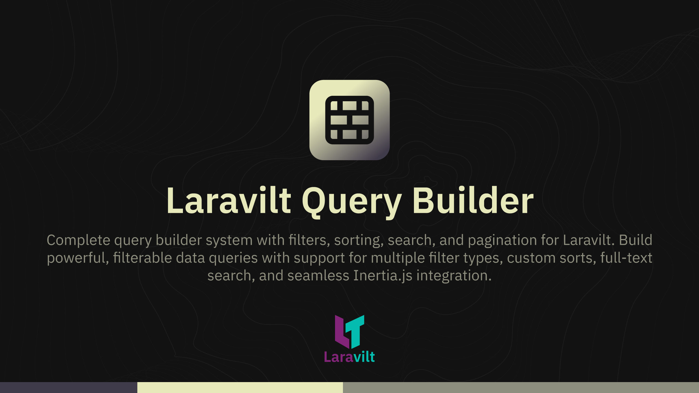

# Laravilt Query Builder

[](https://packagist.org/packages/laravilt/query-builder)
[](https://packagist.org/packages/laravilt/query-builder)
[](https://packagist.org/packages/laravilt/query-builder)
[](https://github.com/laravilt/query-builder/actions/workflows/dependabot/dependabot-updates)
[](https://github.com/laravilt/query-builder/actions/workflows/fix-php-code-styling.yml)
[](https://github.com/laravilt/query-builder/actions/workflows/tests.yml)

Complete query builder system with filters, sorting, search, and pagination for Laravilt. Build powerful, filterable data queries with support for multiple filter types, custom sorts, full-text search, and seamless Inertia.js integration.

## Features

- 🔍 **Advanced Filtering** - Multiple filter types (select, date, range, boolean)
- ↕️ **Sorting** - Custom sort options with direction control
- 🔎 **Search** - Full-text search across multiple columns
- 📄 **Pagination** - Built-in pagination support
- ⚡ **Inertia Integration** - Seamless Vue 3 integration
- 🎯 **Eloquent Compatible** - Works with Laravel's query builder
- 🔧 **Customizable** - Extensible filters and sorts

## Installation

```bash
composer require laravilt/query-builder
```

The package will automatically register its service provider.

## Quick Start

```php
use Laravilt\QueryBuilder\QueryBuilder;
use Laravilt\QueryBuilder\Filters\SelectFilter;
use Laravilt\QueryBuilder\Filters\DateFilter;
use Laravilt\QueryBuilder\Sort;

$queryBuilder = new QueryBuilder();

$queryBuilder
    ->filters([
        SelectFilter::make('status')
            ->options([
                'active' => 'Active',
                'inactive' => 'Inactive',
            ]),

        DateFilter::make('created_at')
            ->label('Created Date'),
    ])
    ->sorts([
        Sort::make('name')->label('Name'),
        Sort::make('created_at')->label('Date'),
    ])
    ->search('search query')
    ->sortBy('created_at', 'desc')
    ->perPage(25)
    ->apply(User::query())
    ->paginate();
```

## Filter Types

### Select Filter

```php
use Laravilt\QueryBuilder\Filters\SelectFilter;

SelectFilter::make('status')
    ->label('Status')
    ->options([
        'active' => 'Active',
        'inactive' => 'Inactive',
        'pending' => 'Pending',
    ])
    ->multiple(); // Allow multiple selections
```

### Date Filter

```php
use Laravilt\QueryBuilder\Filters\DateFilter;

DateFilter::make('created_at')
    ->label('Created Date')
    ->between(); // Date range filter
```

### Range Filter

```php
use Laravilt\QueryBuilder\Filters\RangeFilter;

RangeFilter::make('price')
    ->label('Price Range')
    ->min(0)
    ->max(1000);
```

### Boolean Filter

```php
use Laravilt\QueryBuilder\Filters\BooleanFilter;

BooleanFilter::make('is_active')
    ->label('Active Only');
```

## Sorting

```php
use Laravilt\QueryBuilder\Sort;

Sort::make('name')
    ->label('Name')
    ->default(); // Set as default sort

Sort::make('created_at')
    ->label('Date')
    ->desc(); // Default direction: desc
```

## Search

```php
$queryBuilder->search($request->get('search'));

// Search across specific columns
$queryBuilder->searchColumns(['name', 'email', 'phone']);
```

## Pagination

```php
// Enable pagination (default)
$queryBuilder->paginated();

// Set per page
$queryBuilder->perPage(25);

// Disable pagination
$queryBuilder->paginated(false);
```

## Applying to Eloquent Query

```php
$query = User::query();

$queryBuilder
    ->filters([...])
    ->apply($query)
    ->paginate();
```

## Inertia Integration

```php
use App\QueryBuilders\UserQueryBuilder;
use Inertia\Inertia;

public function index(Request $request)
{
    $queryBuilder = new UserQueryBuilder();

    $users = $queryBuilder
        ->fromRequest($request)
        ->apply(User::query())
        ->paginate();

    return Inertia::render('Users/Index', [
        'users' => $users,
        'queryBuilder' => $queryBuilder->toInertiaProps(),
    ]);
}
```

## Vue 3 Component

```vue
<template>
  <div>
    <!-- Filters -->
    <QueryBuilderFilters
      :filters="queryBuilder.filters"
      @update="handleFilterUpdate"
    />

    <!-- Search -->
    <SearchInput
      v-model="search"
      @search="handleSearch"
    />

    <!-- Results -->
    <DataTable :data="users" />

    <!-- Pagination -->
    <Pagination :data="users" />
  </div>
</template>

<script setup>
import { ref } from 'vue'
import { router } from '@inertiajs/vue3'

const props = defineProps({
  users: Object,
  queryBuilder: Object
})

const handleFilterUpdate = (filters) => {
  router.get('/users', { filters }, { preserveState: true })
}
</script>
```

## Configuration

Publish the config file:

```bash
php artisan vendor:publish --tag="laravilt-query-builder-config"
```

## Assets

Publish the plugin assets:

```bash
php artisan vendor:publish --tag="laravilt-query-builder-assets"
```

## Testing

```bash
composer test
```

## Code Style

```bash
composer format
```

## Static Analysis

```bash
composer analyse
```

## License

The MIT License (MIT). Please see [License File](LICENSE.md) for more information.
